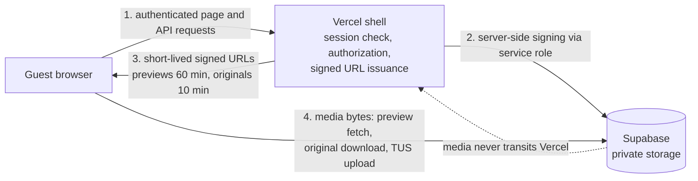

# 0719 + co. Architecture

**Status: v1, finalized by packet 12 (2026-07-22).** This document describes the system as built and code-reviewed against the real source tree. The system is not deployed anywhere (see `docs/0719_Launch_Checklist_v1.md`). Two integration-time defects found this pass are already fixed (a broken rate-limit RPC, a blocked media sync now in progress); two remain open (a failing lint step, an e2e suite not fully green yet). See "Known issues" at the end before treating any claim here as "works in production today."

System architecture for the 0719 + co. digital wedding home as designed in the plan at `docs/plans/2026-07-22-0719-digital-wedding-home/`. Facts below come from the manifest and packets 01 through 13, cross-checked against the landed code on 2026-07-22.

## Stack

- Next.js 16.2.x App Router, React 19.2.x, TypeScript 5.9.x, Tailwind CSS 4
- Runtime floor: Node.js 20.9, TypeScript 5.1
- Supabase Postgres and private Supabase Storage, on an **existing shared project ("PrizmLounge", ref `rnfvmqflktghriqefatc`)**, not a dedicated project. Every table, function, and bucket this app owns is prefixed `rachandzach_` (tables/functions) or `rachandzach-` (buckets) as the tenancy boundary on a project that also hosts roughly 200 unrelated tables for other apps. Grants are fail-closed: only `postgres` and `service_role` hold privileges on any `rachandzach_` object, zero grants to `public`/`anon`/`authenticated`, RLS enabled with zero policies (default deny).
- Supabase Auth for admin magic links
- Uppy with TUS for resumable guest uploads (transport confirmed by the packet 08 spike)
- Resend and React Email for notifications (disabled until sender domain approval)
- Vitest, Playwright, and axe-core for testing
- Vercel hosts the application shell; deploy only after Zach approves

## Data flow

Vercel serves the app shell and performs all authorization. Browsers upload to and download from private Supabase Storage through short-lived signed URLs issued server-side. Original media never transits Vercel: single-photo downloads redirect to a 10-minute signed original URL, multi-photo ZIPs are assembled in the browser with @zip.js/zip.js streaming signed originals directly from Supabase, and preview URLs are batch-signed per visible gallery page.

## Storage buckets

All five buckets are private. Signed URLs are issued server-side only. Guests never receive a service-role key. Names carry the `rachandzach-` prefix (renamed 2026-07-22 for the shared PrizmLounge project; `src/lib/supabase/schema.ts`'s `STORAGE_BUCKETS` is the single source of truth, cross-checked by `tests/database/schema.test.ts`).

| Bucket | Purpose |
|---|---|
| rachandzach-originals | Immutable byte-identical source copies |
| rachandzach-previews | Content-hashed display derivatives |
| rachandzach-guest-pending | Quarantined guest uploads, no guest reads |
| rachandzach-guest-approved | Approved guest originals and previews |
| rachandzach-download-exports | Short-lived generated artifacts, if later enabled |

Object rules: originals at `originals/{imageDataHash}/{sha256Prefix}-{sanitizedOriginalFilename}`, previews at `previews/{imageDataHash}/{width}.{format}` with `cache-control: public,max-age=31536000,immutable`, guest pending uploads at `pending/{batchId}/{itemId}/{randomNonce}`. No upserts, no overwrites; policy plus content-hash naming prevent source object replacement. The project-wide max single-upload size is confirmed at 1 GiB, comfortably above both the 50 MB guest-upload bucket cap and the ~7.2 MB average original.

## Table model

Defined in `supabase/migrations/` (packet 03), extended by packet 07. Every table, function, and trigger carries the `rachandzach_` prefix (tenancy boundary on the shared PrizmLounge project; there is no unprefixed variant).

- `rachandzach_events`, `rachandzach_people`: catalog dimensions with stable slugs
- `rachandzach_photos`: one row per photo keyed by unique `image_data_hash`, carrying `file_sha256`, original bucket and object, dimensions, `captured_at`, source (photographer or guest), and status
- `rachandzach_photo_people`, `rachandzach_photo_keywords`, `rachandzach_photo_previews`: join and derivative tables
- `rachandzach_upload_batches`, `rachandzach_upload_items`: guest submission lifecycle with hashed receipt tokens
- `rachandzach_moderation_actions`: before and after JSON audit for every moderation or metadata change
- `rachandzach_notification_log`: idempotency-keyed email history
- `rachandzach_rate_limit_buckets`: windowed counters behind `rachandzach_consume_rate_limit()` (see "Known issues": this function errored on every call until a corrective migration landed during packet 12)
- `rachandzach_gallery_events`: optional non-identifying analytics, metadata constrained to an allowlisted scalar key set
- `rachandzach_photo_embeddings` (packet 07): 512-dimension CLIP vectors for Moment Search, pgvector, separate reversible migration

Anonymous direct writes to catalog, moderation, notification, and storage objects are denied. Default deny wins. Live-verified 2026-07-22 against the cloud project: all 12 core tables present with zero drift from the migration source, RLS on with zero policies on every table, zero grants to `public`/`anon`/`authenticated` on any table or function.

## Auth model

- **Shared guest session.** Guests enter one shared password. The server verifies against an Argon2id hash (`GALLERY_PASSWORD_HASH`) and issues a signed, versioned session token in the `rz_gallery_session` cookie: HttpOnly, Secure in production, SameSite=Lax, 30-day expiry. Production credentials fail closed: no fallback passwords or session secrets, and a production build without required credentials fails with a configuration error. `GALLERY_SESSION_SECRET` must be at least 32 random bytes.
- **Admin.** Supabase magic links with an exact lowercase allowlist containing only wedding@rachandzach.com. A valid guest cookie never grants admin access. `/admin` and `/api/admin` require `requireAdmin()`.
- **Default-deny proxy.** `src/proxy.ts` consumes an exported `PUBLIC_ROUTES` allowlist. Only `/`, `/weekend`, `/playlists`, `/marathon`, `/enter`, `/api/access`, `/auth/callback`, `/robots.txt`, `/sitemap.xml`, and Next static plus public brand assets skip the guest session check. Any unlisted route is protected until explicitly added.
- **Rate limiting.** 5 failed login attempts per 15 minutes per hashed IP plus a small global limit, via `rachandzach_consume_rate_limit()`. Access responses never reveal whether the configured password or admin account exists. This RPC errored on every call until a corrective migration landed and was live-verified during packet 12; see "Known issues" below.

## Import and sync pipeline

- **Source.** `/Users/zsoskin/Downloads/Rachel & Zach - Wedding Master Clean` is read-only. The catalog source is `_Metadata/photo-manifest.csv`; `_Review`, `_Metadata`, and `By Person` are excluded. July 22 reference snapshot: 1,721 unique primary JPEGs across 14 events.
- **Identity and integrity.** `image_data_hash` is the stable visual identity across metadata edits. `file_sha256` is computed from current source bytes; original downloads must match it byte for byte. Sources are never resized, recompressed, rewritten, or metadata-stripped. Both hashes are verified before and after derivative generation; any change aborts the run.
- **Importer (packet 02).** `scripts/build-gallery-v2.mjs` parses the CSV with an explicit schema, reads `capturedAt` and keywords from EXIF/XMP via exifr read-only, rejects duplicate hashes, and emits `gallery-v2.json` plus an import report. Derivatives: widths 480, 960, 1600 in AVIF and WebP plus a 2400 high-quality JPEG, generated only when smaller than source, never upscaled, written atomically.
- **Sync (packet 13).** `sync-gallery-storage.mjs` and `sync-gallery-catalog.mjs` are dry-run by default, resumable, and idempotent. Uploads use upsert false, verify hashes immediately before upload, and land originals and previews before catalog rows. Cloud writes require both `--execute` and an explicit allowlisted `--project-ref`. Orphans are reported, never deleted. The tool itself is proven end-to-end against the real cloud project (dry-run planning, real upload, real catalog upsert, idempotent re-run, cleanup all verified with a small synthetic dataset). The real full-catalog run is not complete; see "Known issues" below.

## Moderation state machine

Guest uploads (packets 08 and 10):

- Item states: `draft -> uploading -> submitted -> approved | rejected`, with `expired` reachable from draft and uploading
- `approved` and `rejected` are terminal in the normal UI; reversal requires an explicit admin restore plus a new audit record
- A batch becomes `approved`, `partially_approved`, or `rejected` only after all items are terminal
- Approval preserves the submitted original in private storage, creates stripped display derivatives first, then inserts catalog rows; visibility only after the approved asset and previews exist
- All transitions are idempotent and retry-safe with compensating cleanup; every action writes before and after JSON to `moderation_actions`
- Notifications are at-most-once per event via idempotency keys in `notification_log`

## Feature-flag system

`FeatureFlags` is a typed object in `src/content/features.ts` (packet 01): `playlists`, `marathon`, `momentSearch`, `anniversaryCapsule`, `memoryNotes`. Rules:

- Disabled flags render nothing: no navigation entry, no sitemap entry, no placeholder page or card; flagged routes return not found
- `playlists`, `marathon`, `anniversaryCapsule`, and `memoryNotes` start false and enable only when real content and approvals arrive
- `momentSearch` is true only in development until packet 07 passes, and stays off in production if p95 query latency exceeds 1500 ms or the model license is unresolved
- Flag behavior is enforced by unit tests in packet 01 and packet 11

## Known issues

Found during packet 12 integration; full detail and live status in `docs/0719_Launch_Checklist_v1.md` (section 1) and `docs/0719_Content_Needed_v1.md`. None are architectural flaws.

1. **`rachandzach_consume_rate_limit()` errored on every call. FIXED.** Root cause: in `supabase/migrations/202607220001_gallery_core.sql`, the function's `on conflict (key_hash, action, window_start)` clause was unqualified, and Postgres could not tell the conflict-target columns from the PL/pgSQL parameters of the same name -- every code path that calls the rate limiter (guest login, Moment Search, upload-batch creation) caught the RPC error and, per `src/lib/auth/rate-limit.ts`'s fail-closed posture, denied the attempt. A corrective migration, `supabase/migrations/202607220004_rate_limit_conflict_fix.sql` (targets the primary-key constraint by name instead of the ambiguous column list), is applied and live-smoke-tested against the cloud project.
2. **The real full-catalog media sync was blocked, now in progress.** The blocker was this machine's network path corrupting or rejecting HTTPS request bodies roughly above 1 MB (`fetch failed` and LibreSSL `bad record mac`, independent of concurrency). Fix: the real upload path now uses TUS resumable uploads in 1 MB chunks, small enough to stay under the corruption threshold. A real `--execute` sync is running as of this pass; check `metadata/import/gallery-sync-state.json` or `pgrep -fl sync-gallery-storage` for current progress toward the full 13,532 objects (1,721 originals plus 11,811 previews, 14.01 GiB). Catalog sync (`rachandzach_photos`, currently 0 rows) is chained to run automatically once storage completes, per the storage-before-catalog design rule.
3. **`npm run lint` currently fails, blocking `npm run verify`.** The vendored 706 MB Python virtual environment (`.venv-search/`) is now excluded from both `eslint.config.mjs` and `.gitignore` (fixed during this pass). Two things still block a clean run: `playwright-report/` and `test-results/` (generated by running the e2e suite) are not yet excluded either, which floods lint output with noise from a bundled trace-viewer asset; and 4 real `react-hooks/set-state-in-effect` findings remain in `FavoritesGallery.tsx` and `Slideshow.tsx`. Neither is fixed as of this pass.
4. **The bounded Playwright e2e suite (`tests/e2e/`) is not fully green yet**, though it improved substantially within this same pass (from 33 failed to 14 failed out of 110) as fixes landed. See the Launch Checklist for the current pattern.
